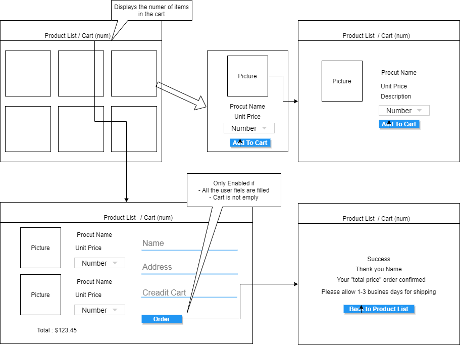
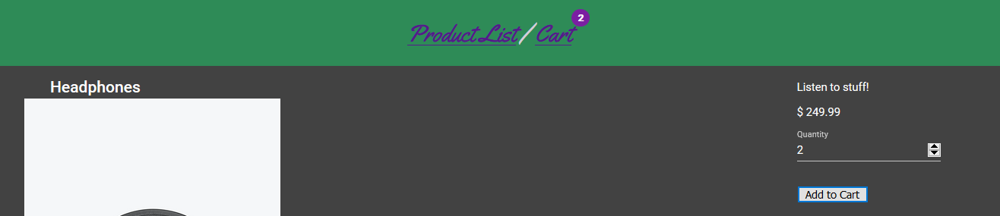
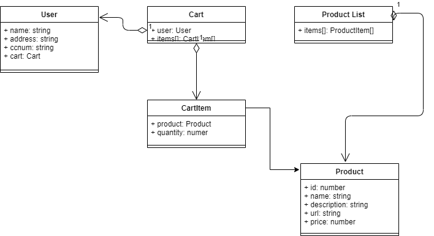
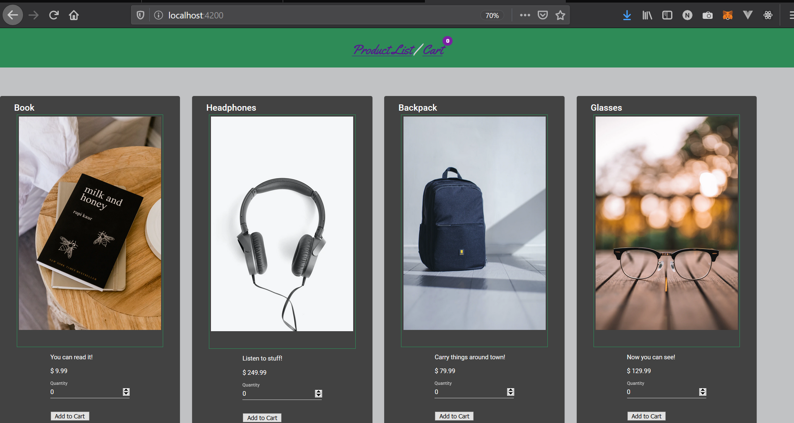

# Angula Demo (My Store)

This is the demo application of Angular SPA (Single Page Application).
To make it simple and focus on the Angular itself, any middleware and backend development is not provide in this repository. If you're intreste in Full-Stack application like MEAN (MongoDB-Express-Angula-Node.js), I am creating another repository for that  purpose.

You can find the demo vieo from the **[link](https://youtu.be/mwxUBUDY3eU)**.

## Application Architecture

### What it does

This Web application provie product catalogue and shopping cart feature on top of Angular SPA.
You choose from a product list and add a number of items to the cart, and finalize the order.
As this is the demo application, it just clears the cart entries, when you click "orer" button in the cart page.

### Page Navigation Design



#### Page Design

Following is provided as a feature in each page desing.

- When the cart is update, the total item count in the header is updated.
- Cart item is updated only when the user pressed the button. If the prouct is in the cart, the button label will be changed from **"Add to Cart"** to **"Update Cart"**.
- When the user set 0 to the quantity, then the product is removed from the Cart.


### Data Model Design




## Use

### Prerequisites

You need [node.js](https://nodejs.org/ja/), [npm](https://www.npmjs.com/), [Angular](https://angular.io/) installed in your enivronment.

Check your version with *ng* command.
Following is the example from my development environment.

```sh
>ng --version

     _                      _                 ____ _     ___
    / \   _ __   __ _ _   _| | __ _ _ __     / ___| |   |_ _|
   / △ \ | '_ \ / _` | | | | |/ _` | '__|   | |   | |    | |
  / ___ \| | | | (_| | |_| | | (_| | |      | |___| |___ | |
 /_/   \_\_| |_|\__, |\__,_|_|\__,_|_|       \____|_____|___|
                |___/


Angular CLI: 12.2.8
Node: 16.9.1 (Unsupported)
Package Manager: npm 7.24.0
OS: win32 x64

Angular: 12.2.8
... animations, cli, common, compiler, compiler-cli, core, forms
... platform-browser, platform-browser-dynamic, router

Package                         Version
---------------------------------------------------------
@angular-devkit/architect       0.1202.8
@angular-devkit/build-angular   12.2.8
@angular-devkit/core            12.2.8
@angular-devkit/schematics      12.2.8
@angular/cdk                    12.2.9
@angular/flex-layout            12.0.0-beta.35
@angular/material               12.2.9
@schematics/angular             12.2.8
rxjs                            6.6.7
typescript                      4.3.5

Warning: The current version of Node (16.9.1) is not supported by Angular.
```

### Project setup

Please clone from my  to download the necessary files.

```sh
mkdir git
~/git$ cd git
~/git$ git clone https://github.com/HajimeK/AngularMyStore
~/git$ cd AngularMyStore
```

### Install dependencies for initialization

Move to the mystore dirctory under src. Then run *npm install* to install dependencies.
```sh
~/git/AngularMyStore$ cd src\mystore
~/git/AngularMyStore/src\mystore$ npm install
```

### Launch the application

```sh
~/git/AngularMyStore/src/mystore$ ng serve
```

After following message is displaye, open *http://localhost:4200* in your broser.
```sh
>ng serve
√ Browser application bundle generation complete.

Initial Chunk Files   | Names         |      Size
vendor.js             | vendor        |   3.93 MB
polyfills.js          | polyfills     | 510.54 kB
styles.css, styles.js | styles        | 460.83 kB
main.js               | main          | 104.68 kB
runtime.js            | runtime       |   6.61 kB

                      | Initial Total |   4.98 MB

Build at: 2021-10-11T03:44:25.934Z - Hash: 96427a721730d5d16706 - Time: 8565ms

** Angular Live Development Server is listening on localhost:4200, open your browser on http://localhost:4200/ **
```

You can see the below page as the top page.

